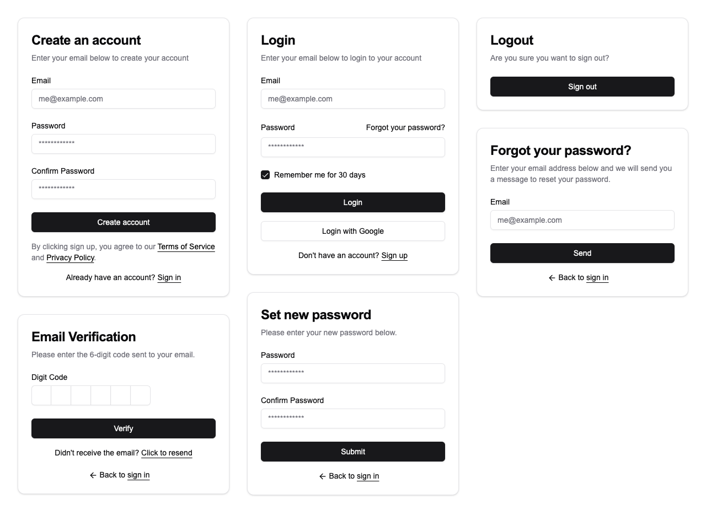

# nextjs14-authjs5-dashboard

This is a dashboard starter template for the [NextJS](https://nextjs.org) 14 app router based on [Auth.js](https://authjs.dev) v5.

## Screenshots



## Table of Contents

- [nextjs14-authjs5-dashboard](#nextjs14-authjs5-dashboard)
  - [Screenshots](#screenshots)
  - [Table of Contents](#table-of-contents)
  - [Denpendencies](#denpendencies)
  - [Folder and file Structure](#folder-and-file-structure)
  - [Getting Started](#getting-started)
  - [Documents](#documents)
  - [Examples](#examples)
  - [Type Definition](#type-definition)
  - [License](#license)

## Denpendencies

- Next.js 14
- Auth.js v5 + Prisma Adapter
- Tailwindcss
- Shadcn
- Prisma
- Zustand
- React Query
- Nodemailer
- Browserslist
- bcrypt.js
- Jose (JSONWebToken)
- Day.js
- qs
- cookies-next
- React Icons

## Folder and file Structure

The folder and file structure is based on nextjs app router [next.js project structure](https://nextjs.org/docs/getting-started/project-structure).

```txt
.
├── actions/                    # Server Actions
├── app/                        # App Router
│   └── api/
│       ├── auth/               # Authentication
│       └── v1/                 # Public APIs
├── components/                 # React components
├── config/                     # Configuration for site
├── context/                    # Context
├── docs/                       # Documents
├── hooks/                      # Hooks
├── lib/                        # Utility functions
├── prisma/                     # Prisma Schema Location and Configuration
├── public/                     # Static assets to be served
│   └── [locales]/              # Internationalization
├── queries/                    # API
├── schemas/                    # Schema validations
├── screenshots/                # Screenshots
├── store/                      # State
├── types/                      # Type definitions
└── package.json
```

## Getting Started

Clone the repository to the current directory.

```shell
git clone https://github.com/w3labkr/nextjs14-authjs5-dashboard.git .
```

Install all modules listed as dependencies.

```shell
npm install
```

Copy of the `.env.example` if the `.env` doesn't exist.

```shell
cp .env.example .env
```

Create an SQL migration file and execute it.

```shell
npx prisma migrate dev --name init
```

Start the development server.

```shell
npm run dev
```

## Documents

- [DEPENDENCIES](./docs/DEPENDENCIES.md)
- [GIT](./docs/GIT.md)
- [PRISMA](./docs/PRISMA.md)

## Examples

ApiResponse

```javascript
import { ApiResponse } from '@/lib/http'

export async function POST(req) {
  return ApiResponse.json(null)
  // { status: 'success', success: true, message: 'OK', data: null }

  return ApiResponse.json({})
  // { status: 'success', success: true, message: 'OK', data: {} }

  return ApiResponse.json({ message: 'hi' })
  // { status: 'success', success: true, message: 'hi', data: {} }

  return ApiResponse.json({ user: null })
  // { status: 'success', success: true, message: 'OK', data: { user: null } }

  return ApiResponse.json({ user: null, message: 'hi' })
  // { status: 'success', success: true, message: 'hi', data: { user: null } }

  return ApiResponse.json({ user: null }, { status: 400 })
  // { status: 'fail', success: false, message: 'Bad Request', data: { user: null } }

  return ApiResponse.json({ user: null, message: 'hi' }, { status: 400 })
  // { status: 'fail', success: false, message: 'hi', data: { user: null } }
}
```

http status codes and text

```javascript
import { 
  STATUS_CODES,
  STATUS_TEXTS,
  STATUS_CODE_TO_TEXT,
  STATUS_TEXT_TO_CODE
} from '@/lib/http'

STATUS_CODES.OK // 200
STATUS_TEXTS.OK // "OK"
STATUS_CODE_TO_TEXT["200"] // "OK"
STATUS_TEXT_TO_CODE["OK"] // "200"
```

Password encryption and verification

```javascript
import { generateHash, compareHash } from '@/lib/bcrypt'

const hashed = await generateHash('hash')

if (await compareHash('hash', hashed)) {
  // isMatch
}
```

Client-side CSRF protection

```javascript
'use client'

import { useCsrfToken } from '@/hooks/use-csrf-token'

export function Component() {
  const csrfToken = useCsrfToken()

  async function onSubmit() {
    const res = await fetch('/api', { 
      headers: { 'X-CSRF-Token': csrfToken } 
    })
  }

  return <button onClick={onSubmit}>Submit</button>
}
```

Server-side CSRF protection

```javascript
import { verifyCsrfToken } from '@/lib/crypto'

export async function POST(req) {
  if (!verifyCsrfToken(req)) {
    return new Response('Unauthorized', { status: 401 })
  }
}
```

Sending mail

```javascript
import { transporter, sender } from '@/lib/nodemailer'

try {
  const info = await transporter.sendMail({
    from: `"${sender?.name}" <${sender?.email}>`,
    to: "receiver@sender.com",
    subject: "Message title",
    text: "Plaintext version of the message",
    html: "<p>HTML version of the message</p>",
  })
} catch (e) {
  console.log(e)
}
```

The time zone and localized format are set.

```javascript
import dayjs from '@/lib/dayjs'

dayjs().toISOString()
```

LucideIcon

```javascript
import { LucideIcon } from '@/components/lucide-icon'

<LucideIcon name="Heart"/>
```

## Type Definition

JWT

```typescript
import { 
  decodeJwt,
  verifyJwt,
  jwtSign,
  generateRecoveryToken,
  generateAccessToken,
  generateRefreshToken,
  generateTokenExpiresAt,
  isTokenExpired
} from '@/lib/jwt'

decodeJwt(jwt: string): PayloadType & JWTPayload
verifyJwt(jwt: string | Uint8Array, options?: JWTVerifyOptions): Promise<JSON | null>
jwtSign(sub: string, exp: number | string | Date = '1h', payload?: JWTPayload): Promise<string>
generateRecoveryToken(sub: string, payload?: JWTPayload): Promise<string>
generateAccessToken(sub: string): Promise<string>
generateRefreshToken(sub: string, jwt?: string | null): Promise<string>
generateTokenExpiresAt(expiresIn: number = 60 * 60): number
isTokenExpired(expiresAt: number, options?: { expiresIn?: number; expiresBefore?: number}): boolean
```

bcrypt

```typescript
import {
  generateHash,
  compareHash
} from '@/lib/bcrypt'

generateHash(s: string): Promise<string>
compareHash(s: string, hash: string): Promise<boolean>
```

crypto

```typescript
import {
  uuidv4,
  generateCsrfToken,
  verifyCsrfToken,
  verifyAjax,
  verifyCsrfAndAjax,
} from '@/lib/crypto'

uuidv4(): `${string}-${string}-${string}-${string}-${string}`
generateCsrfToken(size: number = 32): string
verifyCsrfToken(req: NextRequest): boolean
verifyAjax(req: NextRequest): boolean
verifyCsrfAndAjax(req: NextRequest): boolean
```

math

```typescript
import {
  getRandom,
  getRandomArbitrary,
  getRandomInt,
  getRandomIntInclusive
} from '@/lib/math'

getRandom()
getRandomArbitrary(min: number, max: number)
getRandomInt(min: number, max: number)
getRandomIntInclusive(min: number, max: number)
```

utils

```typescript
import {
  cn,
  wait,
  fetcher,
  absoluteUrl,
  relativeUrl
} from '@/lib/utils'

cn(...inputs: ClassValue[]): string
wait(milliseconds: number): Promise<void>
fetcher(input: RequestInfo | URL, init?: RequestInit): Promise<JSON>
absoluteUrl(url: string | URL, base?: string | URL): string
relativeUrl(url: string | URL, base?: string | URL): string
```

## License

This software license under the [MIT License](LICENSE).
